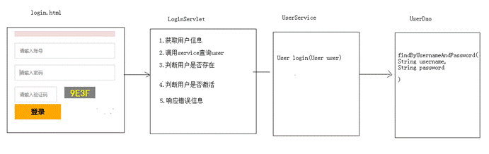
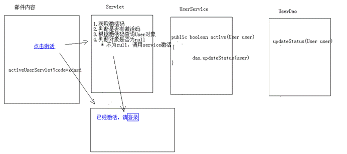

# 项目核心功能的实现

## 登录

## 注册

## 查询

点击了不同的分类后，将来看到的旅游线路不一样的。通过分析数据库表结构，发现，旅游线路表和分类表时一个多对一的关系

查询不同分类的旅游线路sql

Select * from tab_route where cid = ?;

发送 Ajax请求调用后台的 route/pageQuery，查询到的结果使用 json 返回，返回后页面对查询到的结果进行解析，更新页面。

